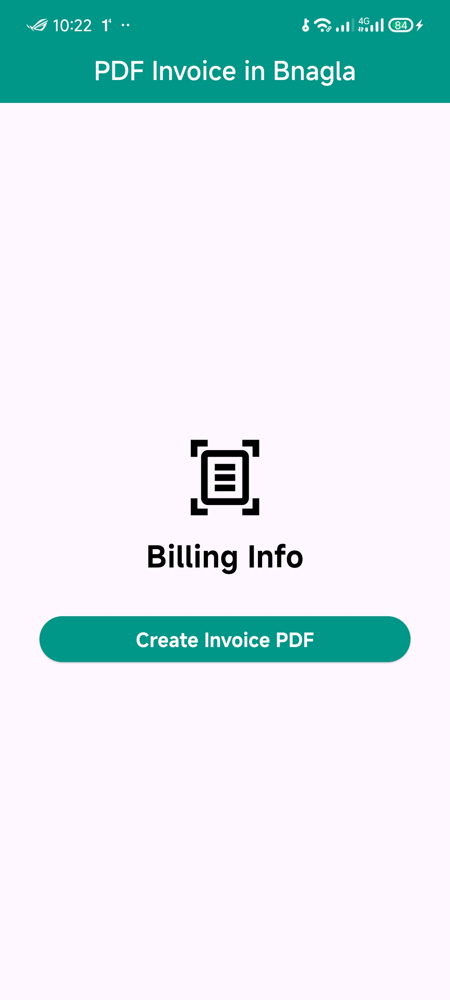

# Generate PDF in Bangla 

Generate PDFs in Bangla without breaking fonts. This code demonstrates the handling of Bangla character rearrangement, replacement, and adjustment to ensure proper ligatures and accurate text rendering.
## What It Does? :
The code is essentially a Bangla text renderer or converter that ensures:

Proper arrangement of Bangla characters for accurate display.
Conversion of text into a desired Bangla font encoding (or mapping).
Removal of invisible characters and unused formatting markers.
## This is often used in:

Converting Bangla text from one legacy encoding to Unicode or vice versa.
Preparing text for custom Bangla fonts or ensuring compatibility with legacy systems.
Rendering Bangla text correctly in environments with limited font or script support.

# Output
[Click here to check the output file](demo/my_invoice.pdf)

## Contributing

Contributions are welcome! If you find a bug or want to suggest a feature, please open an issue or submit a pull request.
